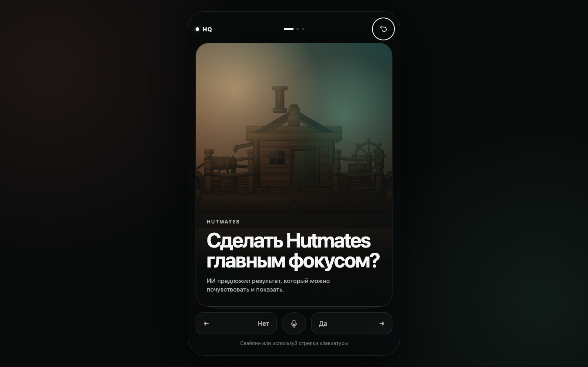

# HQ Deck

A swipe-first interface for turning AI-proposed work into bounded, reviewable execution.

[](https://kiku-jw.github.io/hq-deck/)
[](LICENSE)
[](#quick-start)

[](https://kiku-jw.github.io/hq-deck/)

## Try it

Open the **[live GitHub Pages demo](https://kiku-jw.github.io/hq-deck/)**.

Swipe the card, use the visible `Нет` / `Да` controls, or press the arrow keys.
The interview shapes a plan; it does not grant execution authority. Starting a
mock run and approving publication each require a separate hold gesture.

## Why this exists

AI orchestration interfaces tend to become dashboards full of task metadata,
agent chatter, and irreversible buttons. HQ Deck explores a smaller interaction:
the AI proposes one decision at a time, the human shapes scope with low-effort
choices, and authority remains explicit.

## Features

- Swipe-first adaptive interview with button and keyboard alternatives
- Question-scoped nuance without adding a third primary answer
- Immediate undo and a finite proposal deck
- Plan receipt with outcome, boundaries, acceptance criteria, and gates
- Hold-to-launch interaction that rejects ordinary clicks
- Mock execution phases with stop-after-phase and safe reload behavior
- Separate publication permission and evidence-based completion receipt
- Responsive mobile/desktop layout, visible focus, and reduced-motion support
- Browser-local persistence with no backend or external runtime dependency

## Quick start

No installation or build step is required.

```bash
git clone https://github.com/kiku-jw/hq-deck.git
cd hq-deck
python3 -m http.server 4178 --bind 127.0.0.1
```

Then open <http://127.0.0.1:4178/>. Opening `index.html` directly also works in
modern browsers.

## Safety model

The central constraint is simple: **binary input is not binary authority**.

- A swipe records one bounded preference.
- The generated plan exposes scope before any run starts.
- Launch requires a deliberate hold.
- External publication receives its own permission gate.
- Reloading an active mock run restores it paused instead of continuing silently.
- Completion is derived from prototype state, not from an agent claiming success.

## Tech stack

Native HTML, CSS, and JavaScript. Pointer Events handle gestures and
`localStorage` holds the current demo state. There are no packages, analytics,
API calls, service workers, or build tools.

## Limitations

HQ Deck is an interaction prototype, not a production orchestration system. The
runner is deterministic and performs no real GitHub, agent, deployment, or
external actions. Persistence is local to one browser.

## License

[MIT](LICENSE)
